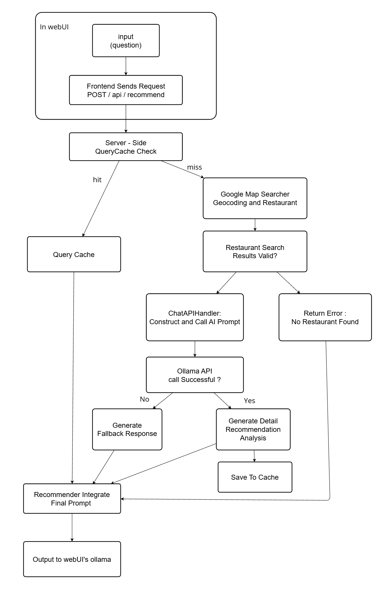

# TOC Final Project : nearby-eats-agent
## Project Description
Nearby Eats Agent is a WebUI plugin that integrates AI-powered restaurant recommendations directly into your WebUI interface. This plugin adds intelligent location-based dining suggestions to enhance your existing WebUI applications with food discovery capabilities.
## Key Features
- Location-Based Search: Find restaurants near any specified location

- Dual-Layer AI Architecture: Combines backend AI analysis with frontend conversational interface

- Intelligent Recommendations: AI analyzes restaurant data to provide detailed, personalized suggestions

- Smart Caching: RAG-based caching system stores AI responses for improved performance

- Modern Web Interface: User-friendly chat interface for natural interactions
## System Architecture
### System Flow Chart (DAG)

### Project Structure
```
nearby-eats-ai/
├── 📁 clients/                      
│   ├── limClient.py              # lab ollama API client
│   └──  mapsClient.py            # Google Maps API client
├── 📁 routes/                 
├── .env                          # Environment variables
├── app.py                        # FastAPI main application
├── cache.db                      # SQLite cache database
├── cache.py                      # Cache system implementation
├── config.py                     # Configuration management
├── main.py                       # Main program entry point
├── recommender.py                # Recommendation system core logic
└── schemas.py                    # Pydantic data models
```
## Getting Started
### setup Open WebUI
1. download [Docker Desktop](https://www.docker.com/products/docker-desktop/)
2. Pull the Open WebUI Image
```
docker pull ghcr.io/open-webui/open-webui:main
```
3. Run the Container
```
docker run -d -p 3002:8080 -v open-webui:/app/backend/data --name open-webui ghcr.io/open-webui/open-webui:main
```
4. Create admin account 
5. Connect to llm
    - open `Admin Setting`
    - From the left menu, select `Connections`
    - Edit Connection - Ollama API : enter new URL and API
### get Google maps API
1. Log in to [Google Cloud Platform](https://console.cloud.google.com/)
2. Click `Select a project` → `New Project`
3. From the left menu, select `APIs & Services`
4. click `+Enable APIs and Services`
5. Search for and enable these APIs :
    - Geocoding API
    - Maps JavaScript API
    - Places API
6. From the left menu, select `google map platform`
7. click `Keys & Credentials`
8. find your project and copy your api key

### setup nearby-eats-agent
1. Prerequisites:
- python 3.8+
- An LLM API Key
- An Google maps API Key
2. Clone the github
```
git clone https://github.com/Chopper226/nearby-eats-agent.git
```

3. Install dependencies:
```
pip install -r requirements.txt
```
4. Add `.env` to set up API key
```
GOOGLE_MAPS_API_KEY=YOUR_API
LAB_API_TOKEN=YOUR_API
```
5. Run the Agent:
```
python main.py
```
### connect agent to webUI
1. open `Admin Setting`
2. From the left menu, select `External Tools`
3. Click `add connection`
4. Enter URL (`http://[YOUR_IP]:5525`) and name for external tools
5. save
6. back to the main chat page and use the tool in `Integrations -> tools`